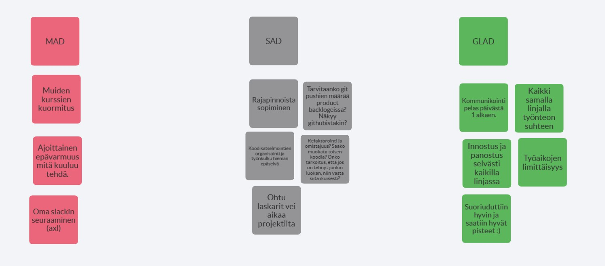

# Raportti

## Projektiin osallistuneet

- Akseli Nurmi
- Antti Kantola
- Susanna Muhli
- Petri Riihikallio
- Niko Nieminen

## Sprinttien aikana kohdatut ongelmat (prosessiin-, projektityöskentelyyn- ja teknisiin asioihin liittyvät)
### Sprint 1
Tiimissä kukaan ei tuntenut toisiaan entuudestaan, joten osaamisten, mielenkiinnon kohteiden ja ajankäytön mahdollisuuksien kartoittamiseen meni alussa aikaa. Seuraavaksi piti sopia yhteisistä työtavoista ja yhteydenpitotavoista. Oma aikansa meni projektin vaatiman infran pystyttämiseen GitHubissa, eri keskustelualustoilla ja Java-Gradle-ympäristöön.
Loppujen lopuksi kovin paljoa valmista koodia ei saatu aikaiseksi eli sprintin hyötysuhde jäi alhaiseksi. Pidimme ensimmäisen sprintin retrospektiivin heti asiakastapaamisen perään Zoomissa. Käytimme Mad-Sad-Glad -retrospektiivitekniikkaa ja keräsimme ajatukset pseudoanonyymisti kuvan 1. mukaisesti Flingaan.

Kuva 1. Ensimmäisen sprintin jälkeinen retrospektiivi Mad-Sad-Glad –tekniikalla.

### Sprint 2
Toisessa spritissä emme ymmärtäneet Product backlogin järjestyksen tärkeyttä asiakkaalle. Meiltä jäi korkeamman prioriteetin user storyja tekemättä, kun alemman prioriteetin user storyja valmistui. 
Toisen sprintin retrospektiivin kävimme Zoomissa keskustellen. Heti asiakastapaamisen perään virinnyttä hyvää ja tarpeellista keskustelua ei kannattanut keskeyttää tai hankaloittaa jollakin teknisellä työkalulla, jollainen oli valmisteltuna Flingaan.
### Sprint 3
Bugien löytäminen ja niiden korjaaminen vei aikaa uusien ominaisuuksien työstämiseltä. Osa bugeista oli jäänyt aiemmissa sprinteissä huomaamatta, mutta ne tulivat toiminnallisuuden lisääntyessä esiin. Hyvästä kommunikoinnista johtuen ensimmäisten sprinttien aikana ei tullut merge-konflikteja GitHubiin, joten merge-konfliktien kohtaamisen ja käsittelyn prosessit jäivät vielä kehittämättä kuntoon.
## Mikä sujui projektissa hyvin, mitä pitäisi parantaa seuraavaa kertaa varten?
### Mikä sujui hyvin?
Opimme aiempien sprinttien virheistä ja onnistuimme parantamaan toimintaamme sprintti sprintiltä. Perusta tälle inkrementaaliselle kehitykselle luotiin projektin alussa, kun käytimme reilusti aikaa keskusteluun ja toisiimme sekä aiheeseen tutustumiseen. Koimme alusta alkaen, että kaikki ryhmämme jäsenet olivat sitoutuneet projektin tekemiseen yhdessä ja kurssilla määriteltyjen aikarajojen puitteissa. Tässä varmasti auttoi ryhmien jakosovellus, jonka tekemän pohjatyön vuoksi meille oli helppo löytää riittävästi aikaa tapaamisiin ja yhdessä tekemiseen. Viimeistään kolmannessa sprintissä kommunikointi oli luontevaa. Viimeisessä sprintissä oli mukava päästä kokeilemaan pariohjelmointia.
Velositeetti parani sprintti sprintiltä, kun saatiin kokemusta työkaluista ja työtavat yhtenäistyivät. Alussa aikaa meni muuhun kuin valmiin koodin tuottamiseen.
Dialogi oli asiallista ja kommunikointi sujui hyvin. Työnteon dokumentointi toimi selkeästi, vaikka näin yksityiskohtainen työn etenemisen dokumentointi (taskien statukset ym.) ei ollutkaan opinnoista ennestään tuttua.
### Mitä pitäisi parantaa?
Yhtenevien käytäntöjen sopiminen merge-konfliktien osalta sekä testien kirjoittamisen integroiminen työprosessiin. Myös avun pyytämistä esim. hankalien bugien kanssa olisi voinut tehdä matalammalla kynnyksellä. Tähän asti opintoja ohjelmointia on opeteltu ja tehty yksin ja itse ratkaisemisella on ollut oma arvonsa.
Heti alussa pelisääntöjen sopiminen läsnäolo- / työ- ja tukitunneille olisi selkeyttänyt työskentelyä, varsinkin jos projekti olisi jatkunut pitempään. Hajautetussa etäryhmätyöskentelyssä voi kulua pitkäkin aika ennen kuin saa vastauksia.
## Mitä asioita opitte, mitä asioita olisitte halunneet oppia, mikä tuntui turhalta?
### Mitä asioita opitte?
GitHubin käyttö versionhallinnan lisäksi myös ryhmätyön apuvälineenä oli tärkeä oppi (omien branchien teko, puskeminen GitHubiin, pull requestien teko, niiden katselmointi, kommentointi, korjailu ja lopulta yhdistäminen päähaaraan.) GitHubin issuet olivat hyvä tapa nostaa tärkeitä asioita esille, jotka olisivat muuten hukkuneet keskustelupalstan historiaan. 
Oman työajan arviointiin ja hallintaan tuli lennossa oppia, myös huonojen ja epätehokkaiden kokemusten kautta. Esim. erilaisten bugien selvittely vei paljon enemmän aikaa, kuin mitä osasi odottaa.
Projektin aikana käytetyt jäljellä olevan työajan ja työn edistymisen seurantaan käytetty burndown kaavio osoittautui hyödylliseksi työvälineeksi. Kurssilla aihe tuli tutuksi teorian tasolla, mutta käytännön hyödyn pääsi näkemään projektin edetessä.
### Mitä asioita olisitte halunneet oppia?
Tietokantojen käytölle emme varanneet aikaa.  Ehkäpä asian voisi sisällyttää laskareihin?
Merge konfliktit aiheuttivat ongelmia, eikä niiden ratkomiseen ehditty miettiä toimivaa yhteistä käytäntöä, vaan jokainen joutui ratkomaan ongelmat oman harkintansa mukaan, jos törmäsi merge konfliktiin. Jos projekti olisi jatkunut hieman pidempään, olisi voinut olla hyvä tehdä joitakin merge konflikteja “tarkoituksella” ja miettiä yhdessä, mikä olisi paras käytäntö asian ratkomiseen.
### Mikä tuntui turhalta?
Hieman turhalta tuntui testien kirjoittaminen luokille, jotka sisälsivät vaikka ainoastaan yhden kentän ja jonka toiminta oli ilmeistä, jolloin testaaminen tuntui hieman väkinäiseltä. On toki ymmärrettävää, miksi testien kirjoittamista oli hyvä harjoitella, mutta testaamisen hyödyt tulevat varmaankin paremmin ilmi siinä vaiheessa, kun ohjelma olisi kehittynyt hieman pidemmälle. 
